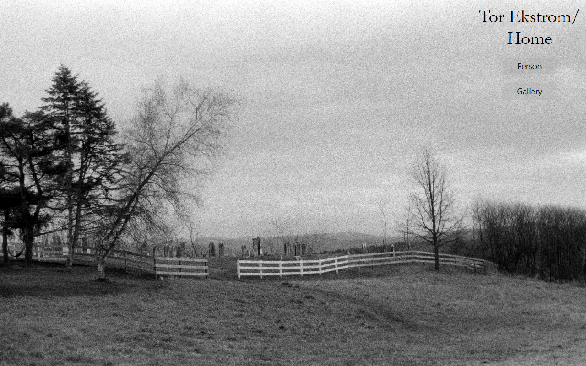
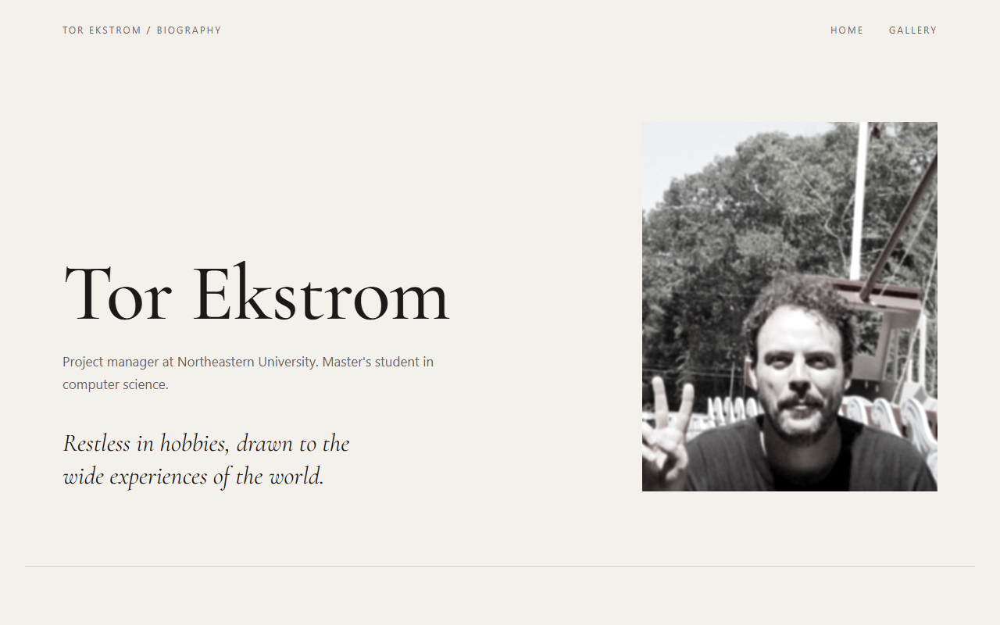

# Tor Ekstrom: Personal Homepage

A personal homepage and film-photography blog, built with vanilla HTML5, CSS3, and ES6 modules.



- **Author:** Tor Ekstrom
- **Class:** [CS 5610 Web Development, Northeastern University, Fall 2026](https://johnguerra.co/classes/webDevelopment_online_fall_2026/index.html)
- **Live site:** _add the GitHub Pages link once deployed_
- **License:** [MIT](LICENSE)

## Project objective

Build a front-end-only personal homepage without a backend, jQuery, or component libraries, where all JavaScript runs as ES6 modules. The site should tell visitors who I am, and include an original feature that sets it apart from other homepages.

For this site, that feature is a **photo blog of my own film photography**. I shoot film and develop my own photos, mostly candids of the people I love and things I find interesting. The gallery is built by JavaScript from a JSON file of photos, and lays them out in a zigzag down the page.

The design is guided by three user personas (see [supportingDocs/users.md](supportingDocs/users.md)):

- Kathy, a mother keeping up with her son's life through his photos
- Marvin, a designer looking for real, intentional imagery
- Kelly, a hiring manager looking for breadth of skills

## Pages

| Page          | File                         | What it does                                                                                                                       |
| ------------- | ---------------------------- | ---------------------------------------------------------------------------------------------------------------------------------- |
| Home          | [index.html](index.html)     | Full-screen photo with the site title and navigation.                                                                              |
| Gallery       | [gallery.html](gallery.html) | Photo blog. [js/gallery.js](js/gallery.js) fetches [galImageData.json](galImageData.json) and builds a zigzag of captioned photos. |
| Bio (AI page) | [bio.html](bio.html)         | Biography. This is the assignment's required **AI-generated page** (see [Use of generative AI](#use-of-generative-ai)).            |



### Features

- **Self-managing navigation:** [js/main.js](js/main.js) builds the nav from one array of pages and leaves out the page you're currently on, so every page shares one nav definition.
- **Data-driven gallery:** adding a photo means adding an entry (`src`, `alt`, `title`, `location`, `date`) to `galImageData.json`. The layout, alt text, and captions all come from that data.
- **Zigzag layout:** each photo's position in the list (`index % 4`) chooses left, center, right, or center. CSS classes do the actual positioning, and flexbox `row-reverse` flips the caption side for photos on the right.

## Built with

- HTML5, CSS3, and JavaScript ES6 modules (no frameworks)
- [Bootstrap 5.3](https://getbootstrap.com/) CSS for its grid (no Bootstrap JavaScript components are used)
- Fonts: [Tangerine](https://fonts.google.com/specimen/Tangerine) and [Cormorant Garamond](https://fonts.google.com/specimen/Cormorant+Garamond), both self-hosted in `fonts/` under the SIL Open Font License
- [ESLint](https://eslint.org/) 10 with the class-provided flat config ([eslint.config.js](eslint.config.js)), and [Prettier](https://prettier.io/) 3

## Getting started

You need [Node.js](https://nodejs.org/), which includes npm.

```bash
git clone https://github.com/tekstrom11/TorEkstromHome.git
cd TorEkstromHome
npm install          # installs ESLint and Prettier (dev tools only)
```

**Run it locally.** The site needs to be served over HTTP, not opened as a file: browsers block ES modules and `fetch()` on `file://` URLs. Any static server works, for example:

```bash
npx live-server      # then open the URL it prints, e.g. http://127.0.0.1:8080
```

**Check the code:**

```bash
npm run lint         # ESLint on js/
npm run format       # Prettier on the whole project
```

There's no build step. The files in the repo are the site.

## Project structure

```
├── index.html          Home
├── gallery.html        Photo blog
├── bio.html            Biography (AI-generated page)
├── galImageData.json   Gallery photos: src, alt, title, location, date
├── css/
│   ├── main.css        Shared and hand-built page styles
│   └── bio.css         Bio page only (AI-generated)
├── js/
│   ├── main.js         Navigation (every page)
│   ├── gallery.js      Builds the gallery from the JSON
│   └── bio.js          Bio page only (AI-generated)
├── images/             Photos and favicon
├── fonts/              Self-hosted web fonts
└── supportingDocs/     Rubric, personas, wireframe, screenshots
```

## Design documents

- Project description: [supportingDocs/description.md](supportingDocs/description.md)
- User personas and user stories: [supportingDocs/users.md](supportingDocs/users.md)
- Wireframe / mockup: [supportingDocs/PersonalWebpageWireframe.pdf](supportingDocs/PersonalWebpageWireframe.pdf)

## Use of generative AI

**Tool:** Claude Code (Anthropic's coding agent) in the VS Code extension.
**Model:** Claude Opus 5.5 (`claude-opus-5-5`, 1M-token context).
**When:** September 26–27, 2026.

| Area                                | How AI was used                                                                                                                                                                                                                                                                                                                                                                                                                                                                                                                 |
| ----------------------------------- | ------------------------------------------------------------------------------------------------------------------------------------------------------------------------------------------------------------------------------------------------------------------------------------------------------------------------------------------------------------------------------------------------------------------------------------------------------------------------------------------------------------------------------- |
| **Project setup**                   | Cleaned up `package.json` and `package-lock.json` carried over from a previous assignment, and added `.gitignore`. Installed the latest ESLint with the class-provided `eslint.config.js`, plus a `.prettierrc` so standalone Prettier agrees with the ESLint Prettier rule.                                                                                                                                                                                                                                                    |
| **Tutoring (most of the project)**  | Early on, I asked Claude to act as a tutor and **not** write solution code unless I asked. For the hand-built pages (`index.html`, `gallery.html`, `css/main.css`, `js/main.js`, `js/gallery.js`), Claude explained concepts and pointed me toward fixes. Topics included CSS backgrounds and `object-fit`, `vh`, positioning, flexbox, the Bootstrap grid, breakpoints and ordering, relative paths, JS scope, `Array.map` indexes, `fetch`, and debugging with the console and ESLint. I wrote and edited those files myself. |
| **Small pieces written on request** | A few generic syntax examples when I asked directly (a placeholder-link nav, `console.log` debugging, multiple classes on one element). Also the first entry of `galImageData.json`, so I could test my gallery code; I added the rest of the photos.                                                                                                                                                                                                                                                                           |
| **The AI-generated page**           | `bio.html`, `css/bio.css`, `js/bio.js`, and `images/favicon.svg` were written by Claude, as the assignment requires. Details and prompts below.                                                                                                                                                                                                                                                                                                                                                                                 |
| **This README**                     | Generated by Claude at my request (we were told this is allowed with disclosure).                                                                                                                                                                                                                                                                                                                                                                                                                                               |

### The AI-generated bio page: prompts and refinements

The page went through four rounds. My prompts are quoted exactly as I typed them.

**Round 1: first draft.**

> ok - so now its time for you your part. For the "AI Generated Page" I'd like you to kind of go nuts playing with the biography page. here's a dictation of some info about me to replace the stock text:

<details>
<summary>The dictation (verbatim)</summary>

> Oh, some information about me. I graduated undergrad with a degree in psychology. Umm, I've. Worked. In, you know, research in cognitive science and. And then also. Uh, in healthcare for a while and I currently, uh, work at uh, as a project manager at, at Northeastern University, where I'm also pursuing a masters of, umm, a masters in, in computer science. Umm, I, umm, have always been someone who uh, has enjoyed having a lot of hobbies, umm. Uh, they include things like umm, football, umm, music, uh, play both the drums and guitar, umm, the. Obviously photography, film photography where I, you know, develop my own photos. And. Uh, like, you know, video games, uh, cooking, uh. Uh, home brewing beer, Uh. And, umm. Uh, small engine building and repair, uh. Lots of other things, uh. Uh, I primarily use photography as a, a way to kind of, uh, document what's going on in, in my life. So, uh, my, uh, you know, preferred subject matter is kind of, uh, candids of, uh, the people I love and the. Things. Images, uh, that I find interesting. Umm. And um. Thanks mom, you can stop bugging me about, uh, putting my pictures on the Internet now. I primary, I like, uh, primarily I like umm, color color photography, but I also enjoy black and white, umm, especially umm. Kind of uh, dark romantic, umm, grainy images, uh, and umm. Yeah, umm. Uh, some of my kind of, uh, sort of professional interests are umm, data and analytics and, and visualization, umm, understanding using data is a kind of lens to understand the world around me. Umm. Software development primarily. Umm. Uh, video games. Umm. And, umm. Also. Trying to find ways that I can sort of, uh. Tie some of the creativity from my hobbies into into my professional life. Umm, my current project portfolio focuses a lot on. Umm. Finding the best place for UMM generative AI in UMM. In education. In higher education. And uh, yeah.

</details>

_Result:_ a busy "darkroom" theme. It had a red safelight glow, animated film grain, a portrait hung from clothespins, a career "film strip," a clickable hobby "contact sheet" with grease-pencil circles, a light switch, and a scroll counter.

**Round 2: pare it back.**

> thanks, can we revise to something a little more minimalist and gothic?

_Result:_ a single dark column with bone-white serif type, oxblood ornaments, a blackletter name, and the portrait inside a gothic arch. All the interactive gimmicks were removed.

**Round 3: design it for a persona (the current design).**

> ok overall this is better, now I'm going to ask yourself to look in the user personsa's and adopt the persona of Kelly's lead web dev, the website that you happened upon that made you alert Kelly is one that was thoughtful, with few flourishes that only a seasoned designer might notice. Your impression of the content was that it's creator pulled inspiration from a broad array of experiences to communicate a subtle intentionality, what pulled you in was hints of a darker romantism beneath a well executed professional exterior. Make that page.

_Result:_ a professional editorial page on warm paper (Path and Practice sections) that fades into a dark "after hours" half (Photography and Pastimes). The fade ends in the page's single ornament, and film grain appears only in the dark half.

The flourishes are deliberately quiet:

- section labels stay in view as you scroll through each section
- the numbers use old-style numerals
- selected text is highlighted in oxblood
- headings and paragraphs use balanced line breaks
- photos warm from grayscale to color on hover
- there's a print stylesheet

Claude also removed the blackletter font, and fixed an accessibility problem it found itself: the oxblood red was too low-contrast to use for text on black.

**Round 4: real details and disclosure.**

> ok i did fix the image, also here's my linkedIn profile so you can add a little more detail to text like "worked there for a while"

I attached a PDF export of my LinkedIn profile. Claude replaced the vague career lines with actual employers, roles, dates, and a few concrete accomplishments, and added my certifications. It deliberately left my phone number and email off the public page. Then:

> ok can you also update the AI disclosure at the bottom to indicate the AI page was a requirement of the assigment?

_Result:_ the page footer now says the assignment required one AI-generated page, and that the rest of the site is built by hand.

**How Claude checked its work:** after each round it ran ESLint, Prettier, and an HTML validator, and viewed desktop and phone-width screenshots in headless Chrome.

### This README

This README was generated by Claude Opus 5.5 in Claude Code from this prompt:

> great, we've been specifically instructed that we can generate a Readme as long as we diclose it, can you do so? especially include the prompt & refinements on the AI Bio page?

Claude also captured the screenshots in `supportingDocs/screenshots/`.
